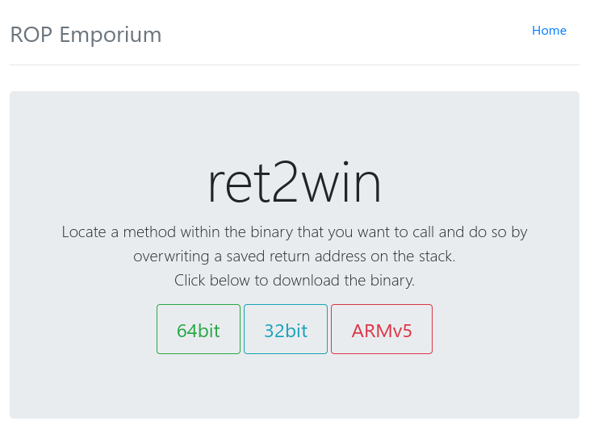
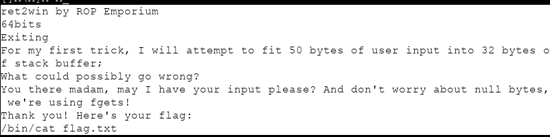
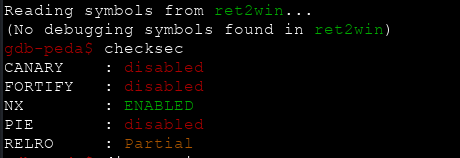
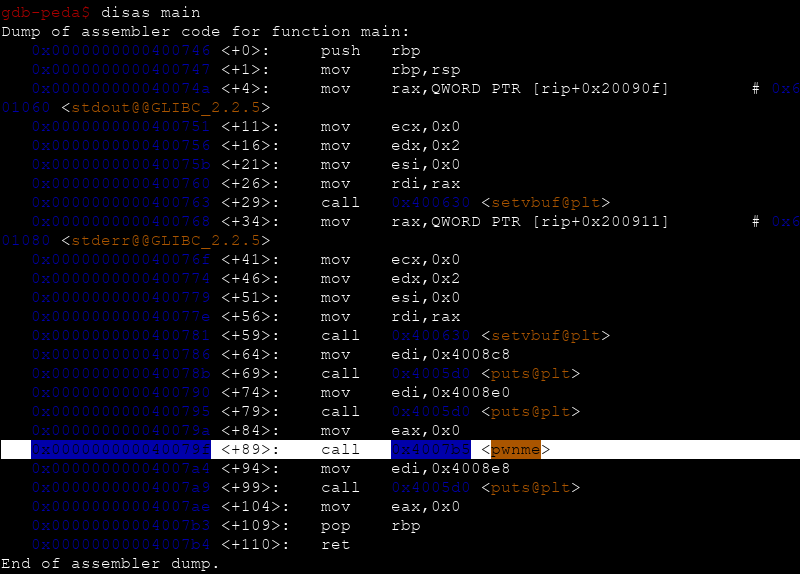
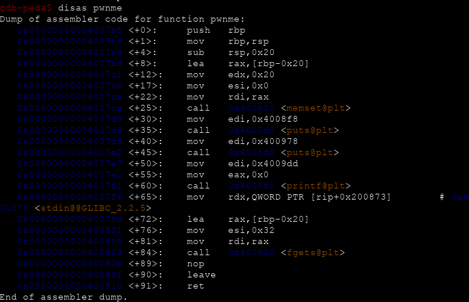
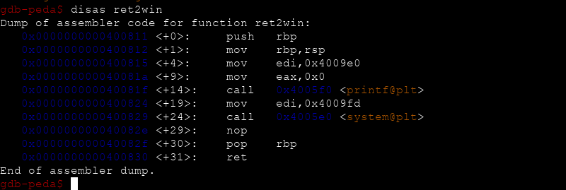
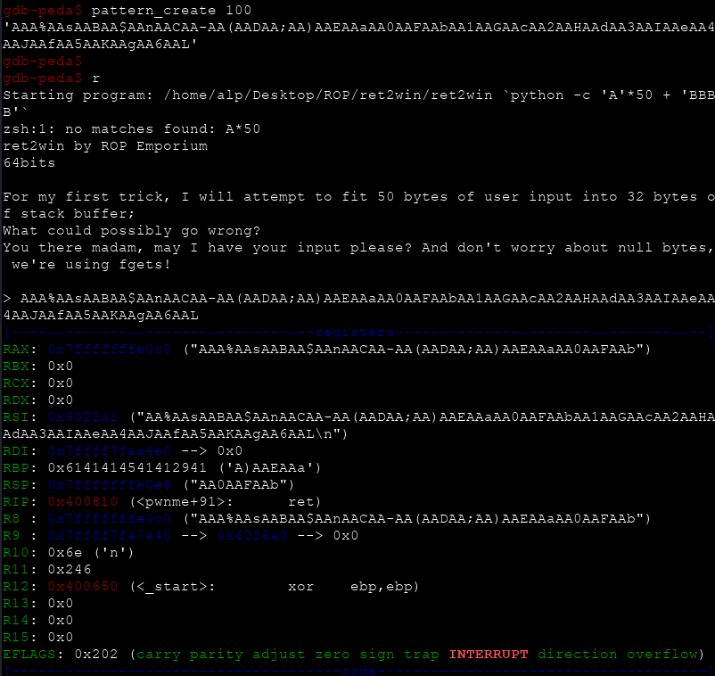
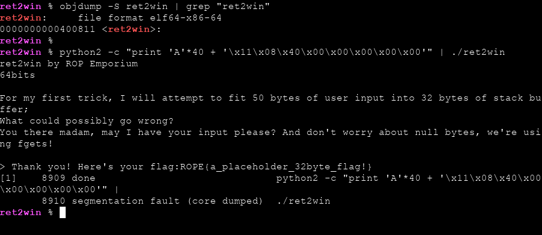

# ROP Emporium `ret2win` Writeup



`x64` mimaride dosyamızı indirdikten sonra ilk olarak `strings ret2win` ve checksec çıktılarına bakalım.



Burda bizim için birkaç açıklama/ipucu olduğunu görüyoruz



Programımızda `NX (non executable stack)` koruması açık. Aynı zamanda sistemimizde `ASLR` koruması da açık.

Kısaca ön bilgi sahibi olduğumuza göre artık gdb ile main fonksiyonumuzu incelemeye geçebiliriz.



Burda `pwnme` isimli bir fonksiyon olduğunu görüyoruz. Adından ötürü tabiki dikkatimizi çekiyor :)



Aynı zamanda programımızın içerisinde `ret2win` isimli bir fonksiyon daha bulunmakta



Programımızın adının da olduğu bu fonksiyonun anlamının `return to win` olduğunu düşünürsek belleği taşırdıktan sonra bu fonksiyonun adresini `rip` üzerine yazarak çalıştırmamız beklenmektedir.

O halde zafiyet bulunan `pwnme` isimli fonksiyonumuzun sonuna bir breakpoint koyarak kaç byte dan sonra `rip` üzerine yazabildiğimize bakalım.



64 bit sistemlerde `RIP` üzerine yazılan adrese eğer program sıçrayamaz veya yürütülecek herhangi birşey bulamazsa o adresi 32 bit mimaride olduğu gibi üzerinde tutmak yerine `rsp` üzerinde tutar. Böylelikle herhangi bir `Segmentation fault` üretmemiş olacaktır.

`RSP` üzerinde yazan değeri arattığımızda offset değerinin 40 olduğunu görebiliriz.

```bash

gdb-peda$ pattern offset AA0AAFAAb
AA0AAFAAb found at offset: 40
gdb-peda$

```

GDB üzerinde `disas ret2win` veya `objdump -S ret2win | grep "ret2win"` diyerek fonksiyonumuzun adresini öğrenebiliriz.

```bash

[alp@eren]$ objdump -S ret2win | grep "ret2win"
ret2win:     file format elf64-x86-64
0000000000400811 <ret2win>:

```

Offsetimizi ve `ret2win` fonksiyonumuzun adresini öğrendiğimize göre artık exploitimizi hazırlayabiliriz.



Gördüğünüz gibi başarılı bir şekilde fonksiyonumuzu çağırıp çalıştırdık ve flag dosyasını okuduk.
